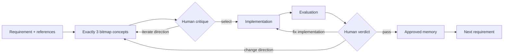

# Loop Designing

**A persistent, human-in-the-loop design harness for Codex.**

Loop Designing turns interface design from a one-shot generation task into a governed learning loop. It produces three visual directions, waits for human critique, implements only the selected direction, evaluates the result, and remembers only the lessons a human explicitly approves.

> **Project status:** early, test-backed release. The workflow is usable, but its schemas and CLI may still evolve. This is an independent experiment and is not an official OpenAI product.

## Why it exists

AI can generate interfaces quickly, but generation is not the hardest part of design. The difficult work is preserving intent, making trade-offs visible, applying critique correctly, and carrying good judgment into the next requirement.

Without a harness, an agent tends to:

- jump from a requirement directly to implementation;
- forget why a direction was accepted or rejected;
- repeat the same taste mistakes in later work;
- treat a passing technical check as design approval.

Loop Designing makes those decisions explicit and durable.

## The loop



There are two non-negotiable human gates:

1. A human selects a concept or requests another concept iteration.
2. A human passes, redirects, or archives the evaluated implementation.

The evaluator cannot approve its own work, and proposed memory is not promoted unless the human approves it.

## How it works

1. **Snapshot the requirement.** Save the requirement, references, project principles, and relevant approved or rejected memory.
2. **Generate concepts.** Produce exactly three genuinely different bitmap concepts from the same inputs.
3. **Record critique.** Preserve the human's words verbatim and either select one concept or generate another set.
4. **Implement.** Build only the selected concept and critique. External systems remain read-only unless the human explicitly authorizes them as delivery targets.
5. **Evaluate.** Combine deterministic checks, design principles, retrieved memory, implementation evidence, and provenance into one evaluation packet.
6. **Record a verdict.** Pass, iterate the implementation, return to concepts, or archive the run.
7. **Promote learning.** Store reusable preferences and anti-patterns only after explicit human approval.

Every transition is persisted, so a run can be inspected or resumed instead of being reconstructed from chat history.

## What is preserved

- requirements and references;
- concept images, hypotheses, and exact generation prompts;
- human critiques and verdicts;
- implementation summaries and visual evidence;
- tracked diffs and archived untracked-file provenance;
- technical-check results and evaluation findings;
- approved and rejected design memory;
- every previous iteration, including failures.

## Safety model

- The harness never chooses a concept for the human.
- Passing automated checks never equals design approval.
- Configured commands require fingerprint-bound human approval before execution.
- External publication or modification requires explicit authorization for that target.
- Project- and tag-scoped learning is not silently broadened into global memory.
- State mutations are locked and revision-checked.
- Canonical memory promotion rolls back if the verdict transition fails.

## Requirements

- Node.js 18 or newer
- Codex with skill support
- Access to a bitmap image-generation capability for concept creation

## Install

Clone the repository:

```bash
git clone https://github.com/Katikita/loopdesigning.git
```

Install it globally for your user:

```bash
mkdir -p "$HOME/.agents/skills"
cp -R loopdesigning/loop-designing "$HOME/.agents/skills/loop-designing"
```

Or install it for one repository:

```bash
mkdir -p .agents/skills
cp -R /path/to/loopdesigning/loop-designing .agents/skills/loop-designing
```

Codex supports global skills in `$HOME/.agents/skills` and repository skills in `.agents/skills`. See the [official Codex skills documentation](https://learn.chatgpt.com/docs/customization/overview#skills).

## Start a run

Open Codex in the product workspace where you want the design work to happen, then invoke:

```text
$loop-designing

Start a new run.

Requirement:
Design a focused account overview for mobile.

References:
- ./references/account-layout.png
- Follow the project's existing visual system.
```

On first use, the skill creates `loop-designing.config.json` in the host workspace. Review it to define:

- project principles and design-rule files;
- persistent run and memory locations;
- deterministic evaluation checks;
- clean-worktree and visual-evidence requirements.

The skill then advances one persisted stage at a time and stops at each human gate.

## Validate the harness

The harness uses only Node's standard library:

```bash
node loop-designing/scripts/test-harness.mjs
```

The test suite covers the complete pass path, both iteration routes, archiving, command approval, environment filtering, memory scoping and rollback, image validation, provenance capture, dirty-worktree protection, concurrency locking, and symlink containment.

## Repository structure

```text
loopdesigning/
├── README.md
└── loop-designing/
    ├── SKILL.md
    ├── agents/openai.yaml
    ├── references/
    │   ├── configuration.md
    │   ├── evaluation-contract.md
    │   ├── memory-contract.md
    │   └── run-contract.md
    └── scripts/
        ├── loop.mjs
        └── test-harness.mjs
```

The repository root contains human-facing project documentation. The `loop-designing/` directory is the clean, installable Codex skill.

## Current boundaries

Loop Designing is a workflow harness, not a design model, hosted service, or replacement for human taste. It currently assumes bitmap concept generation and a filesystem-backed project workspace. Packaging it as a distributable Codex plugin is a possible future step; the skill folder remains the authoring source of truth.
